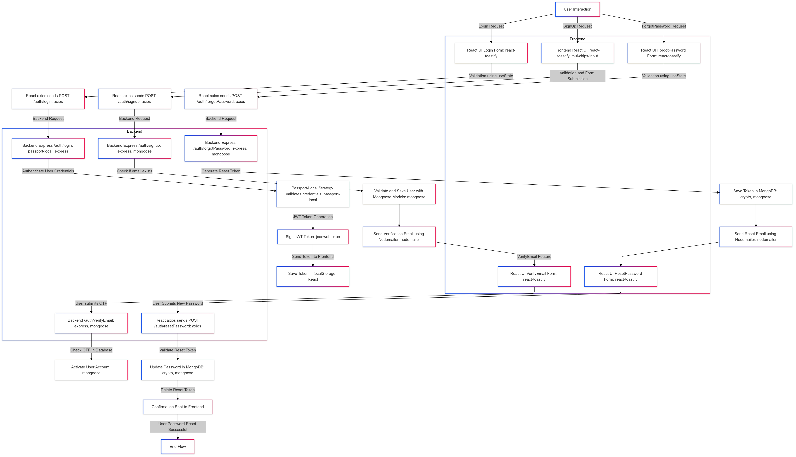

<h1 align="center"><strong>👋 2THN Job Portal Website</strong></h1>

## Overview

2THN Job Portal is a web application designed to connect job seekers with employers, offering a seamless experience to search and apply for jobs, manage job postings, and enhance the recruitment process.

### GitHub Repository

**URL:** [2THN Job Portal GitHub](https://github.com/LeTiepTuyen/Job-Portal-MERN-Project.git)

This project leverages the MERN stack (MongoDB, Express.js, React, Node.js) to deliver a responsive and scalable platform for job management.

---

## Features

- **User Authentication**:
  - Login, Signup, Forgot Password
  - Role-based access for Admin and Users
- **Job Management**:
  - Create, Search, and Apply for Jobs
  - Leaderboard for job performance and ratings
- **Profile Management**:
  - Update Profile and Change Password
- **Admin Dashboard**:
  - Manage job postings, ratings, and user accounts
  - Track system-wide performance
- **Communication Tools**:
  - Real-time notifications via Socket.io
  - Email integration for user notifications
- **Rich Text Editing**:
  - Draft job descriptions with advanced formatting

---

## Technologies

### Frontend

- **React.js**: A library for building user interfaces.
- **Tailwind CSS**: A utility-first CSS framework for fast UI design.
- **Material-UI**: A React-based library for implementing Material Design.
- **Axios**: For making HTTP requests to the backend.
- **Socket.io**: For real-time communication.
- **React Toastify**: Notifications for better UX.
- **React Quill**: Rich text editor for job descriptions.
- **Confetti.js**: Adds celebratory effects for achievements.
- **Flowbite-React**: UI components built with Tailwind.

### Backend

- **Node.js**: Server-side JavaScript runtime.
- **Express.js**: Framework for building RESTful APIs.
- **MongoDB**: NoSQL database for scalable data management.
- **Mongoose**: ODM for MongoDB.
- **Passport.js**: Authentication middleware for user management.
- **Multer**: Middleware for file uploads.
- **Socket.io**: Enables real-time features.
- **Swagger**: Auto-generates API documentation.
- **Nodemailer**: Email delivery service.
- **UUID**: Generates unique IDs for resources.

---

## Project Structure

### Backend

- Backend/
  - Routes/
  - middleware/
  - Controller/
  - model/
  - utils/
  - server.js

### Frontend

- components/
- assets/
- hooks/
- pages/
  - admin/
  - home/
  - landingPage/
- utils/
- libs/apiList
- README.md

---

## Database Description

The database for this project is built using **MongoDB** to provide scalable and efficient data storage. The schema design supports user authentication, job postings, applications, ratings, and admin management.

Explore detailed database documentation and visualizations:

- **[Database Descriptions (PDF)](./database_descriptions/database-descriptions.pdf)**
- **[Database Visualizations (PNG)](./database_descriptions/database-visualization.png)**

For more information, visit the [Database Descriptions Directory](./database_descriptions/).

---

## Prerequisites

Before running the project, ensure the following are installed:

- [Node.js](https://nodejs.org/en/download/)
- [MongoDB](https://www.mongodb.com/try/download/community)
- [Git](https://git-scm.com/downloads)

---

## Project Screenshots

Explore the UI and features of the project through screenshots:

- [Screenshots Directory](./screenshots/)

---

## Authentication and Authorization Flow Chart

Here is a visual representation of the Authentication and Authorization flow for the project:



[Click here to download the Auth Flow Chart](./flowcharts/FlowChart_Authentication_Authorization.png)

---

## Setup Instructions

Follow these steps to set up and run the project locally:

---

### 1. Clone the Repository

Begin by cloning the repository from GitHub:

```bash
$ git clone https://github.com/LeTiepTuyen/Job-Portal-MERN-Project.git
$ cd Job-Portal-MERN-Project
```

### Frontend

The frontend of this project is built using React.js and styled with Material-UI and Tailwind CSS. Follow these steps to set it up:

1. **Navigate to the frontend directory:**

```bash
  $ cd frontend
```

2. **Install the required dependencies:**

```bash
  $ npm install
```

3. **Start the frontend development server:**

```bash
  $ npm run dev
```

The frontend will be available at http://localhost:4000 by default (port can be configured).

## Backend

The backend is powered by Node.js, Express.js, and MongoDB, using libraries like Mongoose for database management and Passport.js for authentication. To set up the backend:

1. **Navigate to the backend directory:**

```bash
  $ cd backend
```

2. **Install the required dependencies:**

```bash
  $ npm install
```

3. **Start the backend server:**

```bash
  $ npm run dev
```

The backend will be available at http://localhost:5000 by default.

---

## API Documentation

API endpoints are documented using Swagger. After starting the backend server, you can access the API documentation at:
`http://localhost:5000/api-docs`

## Development Tools

- Postman: For testing RESTful APIs.
- Swagger UI: For interactive API documentation.
- Nodemon: For hot-reloading during backend development.

# Bugs, issues, and contributing

Found a 🐛? Have a feature request? Feel free to open an [issue](https://github.com/LeTiepTuyen/Job-Portal-MERN-Project/issues) or [contributing](https://github.com/LeTiepTuyen/Job-Portal-MERN-Project)
